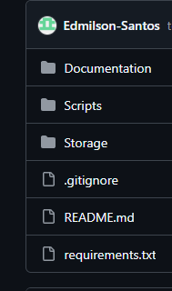

#  Projeto Python - Ambiente Local

Passos do projetos + especificações para rodar local

# Iniciando ambiente 
```bash
python -m venv venv
venv\Scripts\activate
pip install -r requirements.txt

```
# descrição dos scripts
teste imagem


Script principal
[main.py](Scripts/Prod/main.py)
