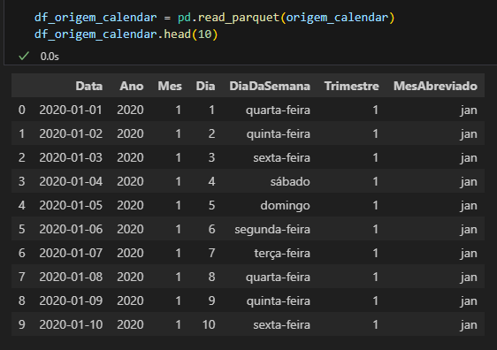

#  Projeto Python - Ambiente Local

Passos do projetos + especificações para rodar local

# Iniciando ambiente 
```bash
python -m venv venv
venv\Scripts\activate
pip install -r requirements.txt

```
# descrição dos scripts


# Creat table x dados gerados
### Mostra como os arquivos foram gerados e a documentação de tabelas em banco 

DimCalendar



Create Table DimCalendar

[DimCalendar.sql](Scripts/Create Table/DimCalendar.sql)


Script principal

[main.py](Scripts/Prod/main.py)
