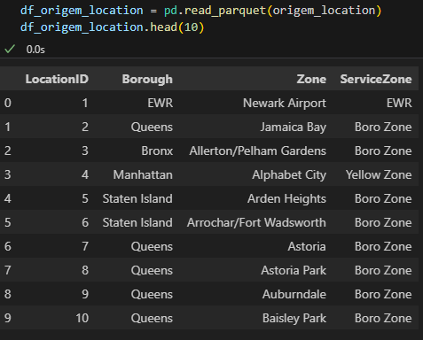

#  Projeto Python - Pipeline Taxi Trips
Passos do projetos + especificações para rodar local

# Iniciando ambiente 
python version 3.11.4
```bash
python -m venv venv
venv\Scripts\activate
pip install -r requirements.txt

```
# Descrição 
## Criação de ETL para visao dimensional em DW tabela Silver 
O que foi entregue com projeto?<br>
1°:Script Python com o pipeline de tratamento e exportação das tabelas fato e dimensão em arquivos parquet.<br>
2°:Scripts SQL para criação das tabelas fato e dimensão (CREATE TABLE).<br>
3°:Documentação contendo o dicionário de tabelas e campos gerados.<br>


## Detalhamento de pastas do projeto 
Script principal pipiline de atualizações de dados:[main.py](Scripts/Prod/main.py)<br>
ETL com python Produção:[Prod](Scripts/Prod)<br>
Ambiente de Dev e Testes:[Dev](Scripts/Dev)<br>
Arquivos de Origem e Destino Após ETL:[Storage](Storage)<br>
Script SQL Create Table [CreateTable.sql](Scripts/CreateTable)<br>


# Dados Gerados x Create Table
### Mostra como os arquivos foram gerados e a documentação de tabelas em banco 


Link de acesso ao diagrama: https://dbdiagram.io/d/Taxi-Trip-682f2c6cb9f7446da3b4556e


#### FactTrips


Create Table FactTrips
[FactTrips.sql](Scripts/CreateTable/FactTrips.sql)


#### DimCalendar


Create Table DimCalendar
[DimCalendar.sql](Scripts/CreateTable/DimCalendar.sql)

#### DimLocation



Create Table DimLocation
[DimLocation.sql](Scripts/CreateTable/DimLocation.sql)

#### DimPayment


Create Table DimPayment
[DimPaymentType.sql](Scripts/CreateTable/DimPaymentType.sql)


#### DimRatecod


Create Table DimRatecod
[DimRateCode.sql](Scripts/CreateTable/DimRateCode.sql)


#### DimStoreFlag


Create Table DimStoreFlag
[DimStoreFlag.sql](Scripts/CreateTable/DimStoreFlag.sql)

#### DimVendor


Create Table DimVendor
[DimVendor.sql](Scripts/CreateTable/DimVendor.sql)


